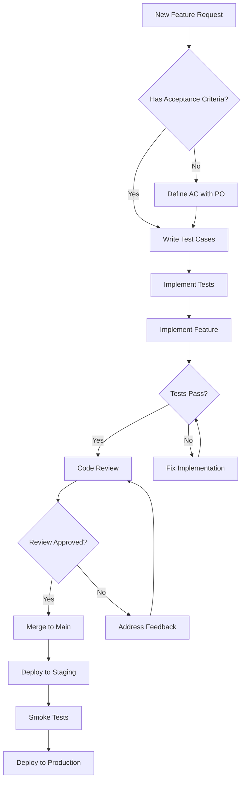
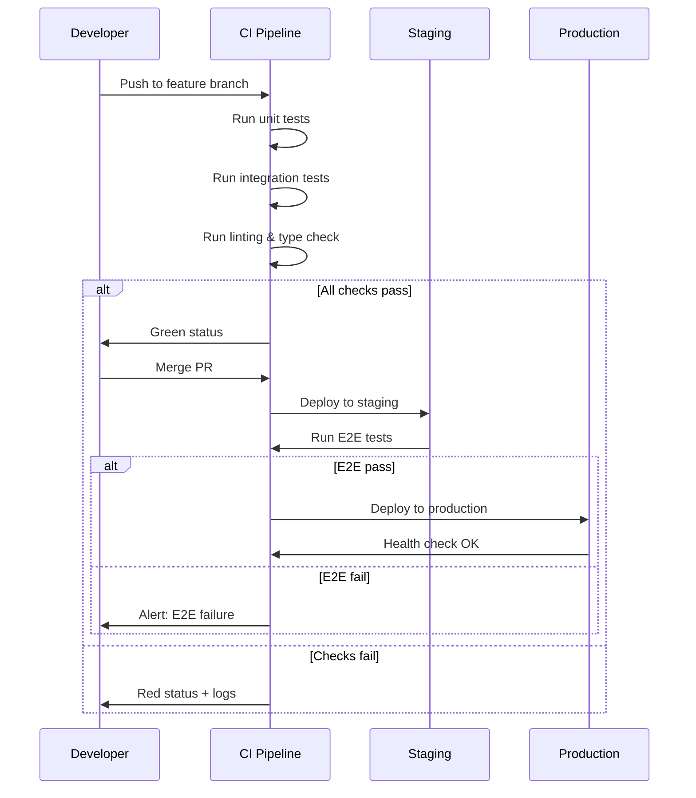
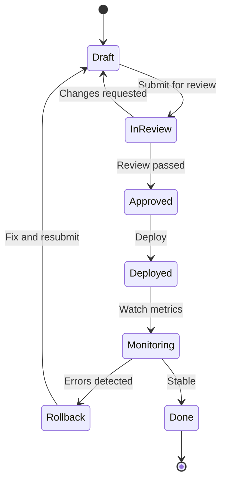
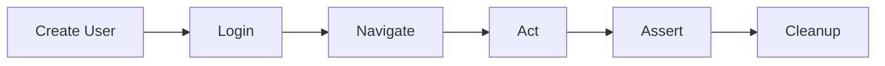

# Style Test Kitchen Sink

This post exists to preview every content element the blog renderer supports. Use it to verify reading mode, typography, spacing, and component rendering.

---

## Table of Contents

- [Typography](#typography)
- [Lists](#lists)
- [Blockquotes & Callouts](#blockquotes--callouts)
- [Code Blocks](#code-blocks)
- [Tables](#tables)
- [Mermaid Diagrams](#mermaid-diagrams)
- [Images & Media](#images--media)
- [Links](#links)
- [Horizontal Rules & Misc](#horizontal-rules--misc)

---

## Typography

### Inline Formatting

This is a paragraph with **bold text**, *italic text*, ***bold and italic***, ~~strikethrough~~, and `inline code`. You can also combine them: **`bold code`**, *`italic code`*, ~~`deleted code`~~.

### Headings Preview

The heading hierarchy looks like this across all three supported levels:

## This is an H2 Heading

### This is an H3 Heading

Regular paragraph text follows headings. Lorem ipsum dolor sit amet, consectetur adipiscing elit. Sed do eiusmod tempor incididunt ut labore et dolore magna aliqua. Ut enim ad minim veniam, quis nostrud exercitation ullamco laboris.

### Long Paragraph

When I first started writing automated tests, I thought the hard part was learning the framework. Selenium, Cypress, Playwright — pick your poison. But after a few years of building test suites that actually survive contact with production, I realized the framework is maybe 20% of the battle. The other 80%? Architecture. How you organize your tests, how you manage state, how you handle the inevitable flakiness that comes with anything touching a browser. The teams that get this right ship faster. The teams that don't? They end up with a 45-minute CI pipeline that fails randomly and everyone just re-runs until it passes. We've all been there.

---

## Lists

### Unordered List

- First item in the list
- Second item with **bold emphasis**
- Third item with `inline code`
- Fourth item that spans multiple lines to test how the renderer handles wrapping in list items when the content is longer than a single line
- Fifth item

### Ordered List

1. Set up the test environment
2. Write the test plan
3. Implement test cases
4. Execute and report
5. Retrospective and iteration

### Nested Lists

- Test Strategy
  - Functional Testing
    - Unit tests
    - Integration tests
    - End-to-end tests
  - Non-Functional Testing
    - Performance testing
    - Security testing
    - Accessibility testing
- Test Execution
  - Manual exploratory
  - Automated regression
  - CI/CD pipeline

### Task List (GFM)

- [x] Define test scope
- [x] Set up test environment
- [ ] Write test cases
- [ ] Execute test suite
- [ ] Generate report

---

## Blockquotes & Callouts

### Simple Blockquote

> Testing is not about finding bugs. It's about delivering information — risk signals — to the people who make shipping decisions.

### Nested Blockquote

> The best test automation strategy is the one your team actually maintains.
>
> > "Any test that requires human intervention to verify results is not an automated test." — James Bach

### Callout Patterns

> **Key Insight:** The most reliable test suites I've seen share one trait: they test behavior, not implementation. When you assert against CSS selectors or DOM structure, you're coupling your tests to the how. When you assert against user-visible outcomes, you're testing the what.

> **Hot Take:** Page Object Model is overengineered for most projects. If your app has fewer than 20 pages and your team is under 5 people, you're adding abstraction layers that slow you down more than they help. Fight me.

> **Tech Note:** Playwright's `auto-waiting` mechanism handles most timing issues out of the box. If you find yourself adding explicit waits (`page.waitForTimeout()`), you're likely fighting the framework instead of using it.

> **Warning:** Never store credentials in test fixtures or environment files committed to version control. Use a secrets manager or CI/CD variables. This sounds obvious, but I've seen it in production repos at Fortune 500 companies.

---

## Code Blocks

### TypeScript

```typescript
interface TestResult {
  name: string;
  status: "passed" | "failed" | "skipped";
  duration: number;
  error?: {
    message: string;
    stack: string;
  };
}

async function runTestSuite(tests: TestCase[]): Promise<TestResult[]> {
  const results: TestResult[] = [];

  for (const test of tests) {
    const start = performance.now();
    try {
      await test.execute();
      results.push({
        name: test.name,
        status: "passed",
        duration: performance.now() - start,
      });
    } catch (error) {
      results.push({
        name: test.name,
        status: "failed",
        duration: performance.now() - start,
        error: {
          message: (error as Error).message,
          stack: (error as Error).stack ?? "",
        },
      });
    }
  }

  return results;
}
```

### Python

```python
import pytest
from playwright.sync_api import Page, expect

class TestLoginFlow:
    """End-to-end tests for the authentication flow."""

    def test_successful_login(self, page: Page):
        page.goto("/login")
        page.fill("[data-testid='email']", "user@example.com")
        page.fill("[data-testid='password']", "secure-password")
        page.click("[data-testid='submit']")

        expect(page.locator("[data-testid='dashboard']")).to_be_visible()
        expect(page).to_have_url("/dashboard")

    def test_invalid_credentials(self, page: Page):
        page.goto("/login")
        page.fill("[data-testid='email']", "wrong@example.com")
        page.fill("[data-testid='password']", "bad-password")
        page.click("[data-testid='submit']")

        error = page.locator("[data-testid='error-message']")
        expect(error).to_contain_text("Invalid credentials")
```

### Bash / Shell

```bash
#!/bin/bash
# Run tests with coverage and generate report
echo "Starting test suite..."

npm run test -- --coverage --reporter=verbose 2>&1 | tee test-output.log

EXIT_CODE=${PIPESTATUS[0]}

if [ $EXIT_CODE -eq 0 ]; then
  echo "All tests passed!"
else
  echo "Tests failed with exit code $EXIT_CODE"
  cat test-output.log | grep "FAIL" | head -20
fi

exit $EXIT_CODE
```

### JSON

```json
{
  "testConfig": {
    "baseUrl": "https://staging.example.com",
    "timeout": 30000,
    "retries": 2,
    "reporters": ["html", "json"],
    "projects": [
      { "name": "chromium", "use": { "browserName": "chromium" } },
      { "name": "firefox", "use": { "browserName": "firefox" } },
      { "name": "webkit", "use": { "browserName": "webkit" } }
    ]
  }
}
```

### Inline Code in Context

Use `npm run test` to execute the suite. The `--coverage` flag enables Istanbul coverage collection. Results are written to `./coverage/lcov-report/index.html`.

Long-identifier wrap regression: `message.usage.cache_creation.ephemeral_5m_input_tokens_very_long_field_name_for_overflow_regression_test_DO_NOT_REMOVE` should wrap inside the pill, NOT push the page width past the viewport.

---

## Tables

### Simple Table

| Browser | Engine | Market Share | Supported |
|---------|--------|-------------|-----------|
| Chrome | Blink | 65% | Yes |
| Firefox | Gecko | 3% | Yes |
| Safari | WebKit | 19% | Yes |
| Edge | Blink | 5% | Yes |

### Complex Table

| Test Type | Scope | Speed | Maintenance | Confidence |
|-----------|-------|-------|-------------|------------|
| Unit | Single function/module | ~1ms | Low | Low-Medium |
| Integration | Multiple modules | ~100ms | Medium | Medium |
| E2E | Full user flow | ~5-30s | High | High |
| Visual Regression | UI screenshots | ~2-10s | Medium | Medium-High |
| Performance | Load/response time | ~30-120s | Low | Domain-specific |

---

## Mermaid Diagrams

### Flowchart



### Sequence Diagram



### State Diagram



---

## Images & Media

### Static Image (External)


*Caption: The aesthetic we're going for.*

### Animated GIF (Placeholder)


*Caption: When the CI pipeline finally goes green after 47 retries.*

### Another GIF


*Caption: Me debugging a flaky test at 2 AM.*

---

## Links

### Inline Links

Check out the [Playwright documentation](https://playwright.dev) for the best E2E testing framework available. Also worth reading: [Testing Trophy](https://kentcdodds.com/blog/the-testing-trophy-and-testing-classifications) by Kent C. Dodds.

### Link in Context

The concept of the **testing pyramid** was originally described by Mike Cohn in his book [Succeeding with Agile](https://www.mountaingoatsoftware.com/books/succeeding-with-agile). However, many modern teams have moved toward a [testing trophy](https://kentcdodds.com/blog/the-testing-trophy-and-testing-classifications) or **testing honeycomb** model that emphasizes integration tests over unit tests.

---

## Horizontal Rules & Misc

Content above the rule.

---

Content below the rule.

---

### Mixed Content Block

Here's a section that combines multiple elements to test how they flow together:

The test architecture follows three principles:

1. **Isolation** — each test owns its data and cleans up after itself
2. **Determinism** — no test depends on execution order or shared state
3. **Speed** — if a test takes more than 30 seconds, it belongs in a different suite

> **Key Insight:** These three principles are in tension with each other. Perfect isolation is slow. Perfect speed means sharing state. The art is finding the right trade-off for your team's context.

Here's how that looks in practice:

```typescript
// Good: Each test creates its own user
test("user can update profile", async ({ page }) => {
  const user = await createTestUser();
  await loginAs(page, user);
  await page.goto("/profile");
  await page.fill("#name", "Updated Name");
  await page.click("button[type=submit]");
  await expect(page.locator("#name")).toHaveValue("Updated Name");
  await deleteTestUser(user.id);
});
```

And the corresponding flow:



That's every element the renderer supports. If something looks off, fix the CSS — not the content.
